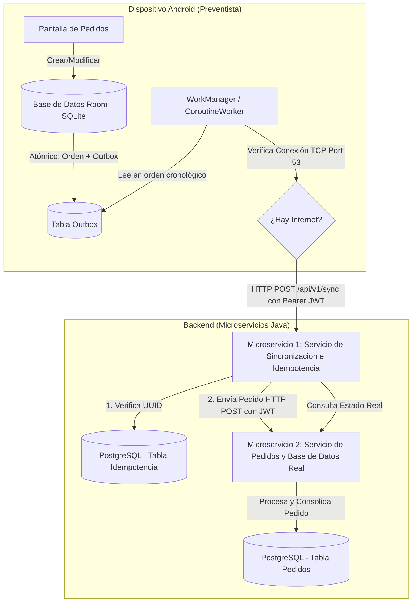

# PRD - Sistema de Registro de Pedidos Offline-First (B2B)

Este documento define el diseño arquitectónico y los requerimientos del producto para el sistema **B2B (Business-to-Business)** de registro de pedidos offline-first para **preventistas** (encargados de visitar clientes y relevar pedidos en la calle). El sistema consta de una aplicación cliente Android/Flutter y dos microservicios Java en el backend.

---

## 1. Arquitectura General del Sistema

El flujo de datos sigue el **Patrón Outbox Transaccional** para garantizar la entrega confiable de mensajes ("at-least-once" delivery con idempotencia en el servidor) y una experiencia fluida para el preventista sin depender de la conectividad en tiempo real. Adicionalmente, el acceso a los endpoints protegidos está restringido mediante autenticación JWT.



---

## 2. Microservicios Backend (Java)

Se diseñarán dos microservicios independientes construidos con **Spring Boot 3.x** y **Java 21**, utilizando una arquitectura estructurada por capas (**Package by Layers**).

### Estructura de Paquetes Común (Package by Layers)
```text
src/main/java/com/sales/service/
│
├── controller/     # Capa de Presentación (REST Controllers, DTOs de entrada/salida)
├── service/        # Capa de Negocio (Interfaces e Implementaciones de lógica de negocio)
├── repository/     # Capa de Acceso a Datos (Interfaces Spring Data JPA)
└── model/          # Capa de Dominio (Entidades JPA del modelo de datos)
```

### Microservicio 1: Sync & Idempotency Service (Servicio de Sincronización)
Este microservicio es la puerta de entrada para los clientes móviles. Es el encargado de emitir tokens de seguridad, recibir los lotes del Outbox, asegurar la idempotencia y redirigir el procesamiento al servicio core.

*   **Responsabilidades**:
    *   Exponer endpoints de autenticación basados en JWT (HS256) con rotación y detección de robos de tokens de refresco (*theft detection*).
    *   Exponer endpoints REST para la sincronización de operaciones de pedidos.
    *   **Control de Idempotencia**: Verificar si un `client_order_id` (UUID de la mutación) ya fue procesado mediante una consulta rápida a una tabla de auditoría en la base de datos PostgreSQL (`processed_requests`).
    *   Delegar la creación del pedido al Microservicio 2 de forma síncrona mediante peticiones HTTP REST incluyendo el token del preventista.
*   **API Endpoints**:
    *   `POST /api/v1/auth/login`: Autentica al preventista (BCrypt hash) y devuelve `access_token` y `refresh_token`. (Público)
    *   `POST /api/v1/auth/refresh`: Permite rotar el refresh token y obtener nuevos tokens de acceso. (Público)
    *   `POST /api/v1/sync`: Recibe un listado de mutaciones del Outbox. (Protegido con JWT)
    *   `GET /api/v1/sync/status/{clientRequestId}`: Consulta el estado de procesamiento de un pedido enviado. (Protegido con JWT)

### Microservicio 2: Core Order & Database Service (Servicio de Pedidos y Base de Datos Real)
Este microservicio interactúa con la base de datos transaccional central. Procesa el negocio real (validación de stock, almacenamiento de pedidos, etc.).

*   **Responsabilidades**:
    *   Gestionar el catálogo de productos y clientes.
    *   Procesar pedidos confirmados y consolidarlos en la base de datos PostgreSQL.
    *   Exponer APIs para que el preventista consulte el estado actualizado y "real" de sus pedidos y el catálogo cuando tenga conexión.
    *   Validar la firma del token JWT localmente con el secreto compartido y proveer información del preventista mediante un contexto local (`VendorContext`).
    *   **Control de Autorización**: Restringir el acceso a los pedidos de forma que solo el preventista dueño de la sesión actual pueda consultar, crear, modificar o eliminar sus propios pedidos (verificación estricta de `vendor_id` del JWT contra `salesperson_id` del pedido).
*   **API Endpoints**:
    *   `POST /api/v1/orders`: Crea o actualiza un pedido definitivo. Requiere que `vendor_id` de la sesión coincida con `salespersonId` del pedido. (Protegido con JWT, retorna 403 en caso de discrepancia o ausencia de preventista).
    *   `GET /api/v1/orders/{order_id}`: Obtiene el detalle consolidado de un pedido. Solo accesible si el pedido pertenece al preventista autenticado. (Protegido con JWT, retorna 403 si pertenece a otro preventista).
    *   `DELETE /api/v1/orders/{order_id}`: Elimina físicamente un pedido y revierte stock. Solo accesible si el pedido pertenece al preventista autenticado. (Protegido con JWT, retorna 403 si pertenece a otro preventista).
    *   `GET /api/v1/orders/catalog`: Descarga de catálogo optimizada para caché local en el dispositivo. (Protegido con JWT)

---

## 3. Estrategia de Sincronización del Cliente Android

El cliente Android/Flutter debe seguir la especificación técnica offline-first para asegurar la consistencia y evitar la pérdida de datos.

### 3.1. Persistencia Local (SQLite + Room)
*   **Base de Datos Local (Móvil)**: Se utiliza **SQLite** debido a que es un motor de base de datos embebido ligero y sumamente rápido, ideal para almacenamiento local en el teléfono.
*   **Claves Primarias UUID**: Todos los pedidos y sus detalles creados en el dispositivo deben usar un UUID generado por el cliente como clave primaria. Esto evita colisiones de ID secuenciales al sincronizarse desde múltiples teléfonos.
*   **Transacción Única**: Toda escritura de pedido se realiza bajo una transacción de base de datos local que:
    1. Inserta o actualiza el pedido en la tabla `orders` (y sus ítems en `order_items`).
    2. Inserta un registro de mutación en la tabla `outbox` con la estructura correspondiente.

```sql
-- Estructura de la Tabla Outbox local
CREATE TABLE outbox (
    id TEXT PRIMARY KEY,           -- UUID de la mutación
    entity_type TEXT,              -- "ORDER"
    entity_id TEXT,                -- UUID del pedido afectado
    operation TEXT,                -- "CREATE", "UPDATE", "DELETE"
    payload TEXT,                  -- Estado del objeto en JSON (ej: el pedido completo)
    timestamp INTEGER,             -- System.currentTimeMillis()
    status TEXT DEFAULT 'PENDING'  -- 'PENDING', 'PROCESSING', 'FAILED'
);
```

*   **Eliminaciones Blandas (Soft Deletes)**:
    *   Si el usuario elimina un pedido localmente, la tabla `orders` se actualiza con `is_deleted = true` o `is_synced = 0`.
    *   Se inserta un registro en `outbox` con `operation = 'DELETE'`.
    *   El pedido solo se elimina físicamente de la base de datos local SQLite después de que el backend confirme la recepción del delete.

### 3.2. Detección de Conectividad Real
*   **NetworkCallback**: Suscripción reactiva mediante `ConnectivityManager`.
*   **Verificación Lógica (Falso Positivo)**:
    *   Antes de iniciar la sincronización, se realiza una prueba rápida abriendo un Socket TCP directo al DNS de Google (`8.8.8.8`) en el puerto `53` con un timeout de 1500 ms.
    *   Esto descarta portales cautivos o conexiones Wi-Fi sin salida real a internet.

### 3.3. Sincronización Asíncrona (WorkManager)
*   Se utiliza un `CoroutineWorker` (o motor de sincronización de background equivalente) con restricciones de red (`NetworkType.CONNECTED`).
*   **Flujo del Worker**:
    1.  Consulta los registros `PENDING` de la tabla `outbox` ordenados por `timestamp` ascendente.
    2.  Envía las mutaciones al backend a través de la API `/api/v1/sync` utilizando la cabecera `Authorization: Bearer <access_token>`.
    3.  **Idempotencia**: Si el servidor devuelve HTTP 200/201, se asume procesado.
    4.  **Confirmación y Purga**: En una transacción de base de datos, elimina los registros correspondientes de la tabla `outbox`. Si la operación fue `DELETE`, elimina físicamente la orden de la tabla `orders`.
    5.  **Manejo de Errores con Jitter**: Si ocurre un error de red o de servidor recuperable (HTTP 5xx, timeouts), el worker retorna un reintento configurado con **Retroceso Exponencial con Jitter** para evitar picos de carga. Si el error es de lógica o irrecuperable (HTTP 4xx o problemas de autenticación como `token_expired`/`token_revoked`), la mutación se marca como `FAILED` para revisión o se solicita una renovación de sesión al usuario.

---

## 4. Requerimientos de Datos e Idempotencia en Servidor

### Control de Duplicados (Idempotencia)
El Microservicio 1 utilizará una tabla de auditoría en la base de datos PostgreSQL llamada `processed_requests` para evitar procesamientos duplicados:
*   `client_request_id` (PK, UUID)
*   `status` (SUCCESS, PENDING, FAILED)
*   `processed_at` (Timestamp)

Cualquier petición entrante con un UUID de mutación ya existente en esta tabla con estado `SUCCESS` evitará llamar al Microservicio 2 y responderá éxito directamente al cliente.
