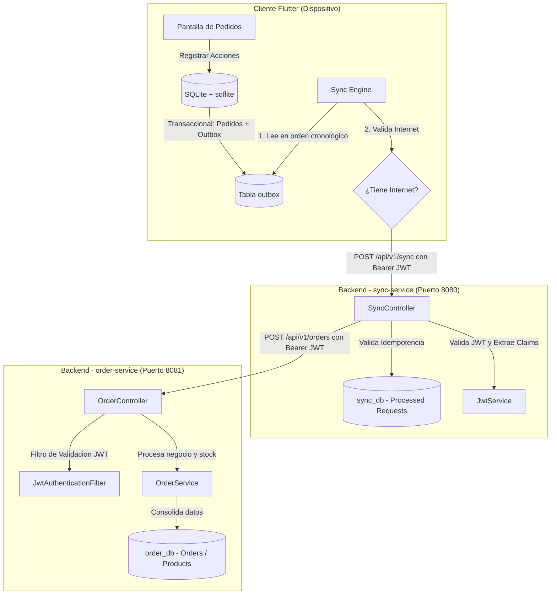

# Arquitectura General del Proyecto

Este documento describe la arquitectura técnica, los patrones de diseño y los mecanismos de seguridad implementados en el sistema **HieloPedido**.

---

## 1. Diseño General e Interacción de Componentes

El sistema sigue una arquitectura distribuida orientada a microservicios en el backend y una persistencia local **Offline-First** en el cliente móvil.



---

## 2. Patrón Transactional Outbox (Offline-First)

Para asegurar la confiabilidad e impedir la pérdida de datos bajo condiciones de conectividad inestable, el cliente móvil utiliza el patrón **Transactional Outbox**:

1. **Escritura Atómica**: Cuando el usuario realiza una acción (crear, modificar o borrar un pedido), la operación se guarda en la base de datos local SQLite bajo una **única transacción** que escribe el estado en la tabla `orders` e inserta una mutación en la tabla `outbox` con estado `PENDING`.
2. **Sincronización Asíncrona**: El motor de sincronización (`Sync Engine`) se dispara al detectar conexión de red (o en intervalos periódicos). Envía en orden cronológico (`timestamp ASC`) el lote de mutaciones pendientes al backend.
3. **Idempotencia en Servidor**: El backend (`sync-service`) valida cada ID de mutación contra una tabla de auditoría local (`processed_requests`). Si la mutación ya se había procesado con éxito anteriormente, la ignora, evitando duplicación en el procesamiento posterior.
4. **Purga Local**: El cliente recibe la lista de IDs de mutaciones que el servidor consolidó con éxito.
   * Si la operación fue `CREATE`/`UPDATE`, se elimina la mutación de la tabla `outbox` local, manteniendo el pedido en SQLite.
   * Si la operación fue `DELETE`, se purga físicamente el pedido de la tabla `orders` local y se elimina la mutación.

---

## 3. Arquitectura de Seguridad (JWT Foundation)

El sistema implementa un esquema de autenticación centralizada y autorización basada en tokens **JWT (JSON Web Tokens)** con firma simétrica **HMAC-SHA256 (HS256)** y rotación de tokens de refresco.

### A. Roles de los Microservicios
*   **`sync-service` (Emisor de Tokens)**:
    *   Gestiona el almacenamiento de credenciales de usuarios (`users`) y tokens de refresco (`refresh_tokens`).
    *   Valida credenciales en `/api/v1/auth/login` (utilizando hashes **BCrypt** con factor de coste configurable, por defecto 12).
    *   Genera tokens de acceso JWT (tiempo de vida corto, ej. 15 minutos) y tokens de refresco (tiempo de vida largo, ej. 7 días).
    *   Expone `/api/v1/auth/refresh` para rotar tokens mediante el patrón *Single-Use Refresh Tokens*.
*   **`order-service` (Recurso Protegido)**:
    *   No tiene acceso directo a la base de datos de usuarios. Valida los tokens de acceso localmente utilizando el secreto compartido `JWT_SECRET`.
    *   Intercepta las peticiones en [JwtAuthenticationFilter](order-service/src/main/java/com/sales/order/auth/security/JwtAuthenticationFilter.java), valida la firma, emisor, audiencia y tiempo de expiración.
    *   Si el token es válido, puebla el contexto de seguridad (`SecurityContext`) y expone los detalles del preventista (denominado en el código como `vendor` / `salesperson`) a través de un bean de alcance de petición (`@RequestScope`) llamado [VendorContext](order-service/src/main/java/com/sales/order/auth/security/VendorContext.java).

### B. Rotación y Detección de Robo de Tokens de Refresco (Theft Detection)
Para evitar el uso malintencionado de tokens de refresco robados, se implementa la técnica de **detección por reutilización (replay)** en [RefreshRotationService.java](sync-service/src/main/java/com/sales/sync/auth/service/RefreshRotationService.java):
*   Cada inicio de sesión genera una **Familia de Tokens** (`token_family`).
*   Cuando un cliente pide un nuevo token usando un `refresh_token`, el servicio:
    1. Inactiva/marca como revocado (`revoked = true`) el token presentado.
    2. Emite un nuevo par de `access_token` and `refresh_token` (este último pertenece a la misma familia).
*   **Detección de Replay**: Si un atacante roba un `refresh_token` que ya ha sido usado (o si el cliente legítimo lo vuelve a usar por error de red), el servidor detecta que el registro ya está marcado como revocado.
*   **Respuesta de Pánico**: Ante una reutilización, el sistema asume que el token fue interceptado. **Revoca inmediatamente todos los tokens activos pertenecientes a esa misma familia** (quemando la familia), forzando a que todas las sesiones de ese flujo deban iniciar sesión de nuevo.

### C. Limpieza Programada de Tokens Expirados (Token Cleanup Job)
Dado que cada inicio de sesión y rotación genera nuevos registros en la tabla `refresh_tokens`, para evitar un crecimiento desmedido de la base de datos se ejecuta un proceso automático en segundo plano:
*   **Orquestación**: Un servicio de limpieza programado (`RefreshTokenCleanupService`) se ejecuta periódicamente utilizando el planificador de Spring (`@EnableScheduling`).
*   **Frecuencia**: Ejecución diaria a las 3:00 AM (configurable mediante la propiedad `auth.cleanup.cron` en `application.yml`).
*   **Criterio de borrado seguro**: La consulta elimina registros donde `expires_at < NOW()`.
    > [!IMPORTANT]
    > **Garantía de Seguridad**: Los tokens revocados pero que **aún no han expirado** no se eliminan de la base de datos. Deben mantenerse activos en el almacenamiento hasta su tiempo de vida original (`expires_at`) para asegurar que el motor de rotación pueda seguir detectando posibles intentos de reutilización (*replay attacks*) y quemar la familia correspondiente en caso de anomalía.

### D. Requerimiento Crítico de Inicio: JWT_SECRET
Para impedir brechas de seguridad por contraseñas débiles en producción, ambos microservicios emplean un validador en el arranque del contexto de Spring (`JwtSecretValidator`).
*   **Regla**: El valor de la propiedad `jwt.secret` (leído de la variable de entorno `JWT_SECRET`) **debe poseer una longitud mínima de 32 bytes (256 bits)**.
*   Si no se cumple esta condición, el contexto falla inmediatamente al iniciar (`ContextRefreshedEvent`), la aplicación lanza un error crítico y se cierra con un código de salida distinto de cero, impidiendo quedar expuesta sin configuraciones seguras.

### E. Autorización de Pedidos por Preventista (BFLA/BOLA Prevention)
Para prevenir vulnerabilidades de autorización a nivel de función y de objeto (OWASP BOLA/BFLA), el sistema de pedidos en `order-service` restringe el acceso de forma estricta:
*   **Contexto de Preventista**: El filtro de JWT (`JwtAuthenticationFilter`) extrae la propiedad `vendor_id` del token de acceso y la almacena en un bean de alcance de petición (`VendorContext`), que expone el ID de forma segura a la capa de control.
*   **Creación y Edición (`POST /api/v1/orders`)**: Se valida que el `salespersonId` provisto en el cuerpo JSON del pedido coincida exactamente con el `vendor_id` almacenado en el `VendorContext` de la sesión.
*   **Consulta por ID (`GET /api/v1/orders/{orderId}`)**: Al buscar el pedido, se verifica que la propiedad `salespersonId` del registro en base de datos coincida con el `vendor_id` de la sesión.
*   **Eliminación (`DELETE /api/v1/orders/{orderId}`)**: Se valida la propiedad del pedido en base de datos antes de proceder a la eliminación física y la reversión de stock.
*   *Cualquier discrepancia de preventista o ausencia de `vendor_id` en la sesión resulta en una respuesta inmediata `403 Forbidden`.*

---

## 4. Diseño del Backend (Layers Architecture)

Ambos microservicios siguen la convención estructural de diseño por capas (**Package by Layers**):

```text
src/main/java/com/sales/
│
├── controller/     # Capa de Presentación: Exposición de endpoints REST y mapeo de DTOs.
├── service/        # Capa de Negocio: Procesamiento de reglas de negocio y transacciones (@Transactional).
├── repository/     # Capa de Acceso a Datos: Interfaces Spring Data JPA conectadas a PostgreSQL.
└── model/          # Capa de Dominio: Entidades JPA con anotaciones de Hibernate.
```

---

## 5. Diseño de Base de Datos (PostgreSQL)

El sistema tiene separadas las responsabilidades de datos en dos esquemas independientes:

### A. sync_db (Base de datos del Servicio de Sincronización)
1.  `users`: Almacena el `id` (UUID), `username`, `password` (BCrypt hash) y el flag `locked`.
2.  `refresh_tokens`: Registra el token hash (`token_hash`), `user_id`, `token_family` (UUID), expiración (`expires_at`), y el estado `revoked`.
3.  `processed_requests`: Tabla de auditoría para idempotencia de sincronización. Guarda el `client_request_id` (UUID del outbox), su estado (`SUCCESS`, `PENDING`, `FAILED`) y la fecha de procesamiento.

### B. order_db (Base de datos del Core de Pedidos)
1.  `products`: Catálogo central de productos (`id`, `name`, `price`, `stock`).
2.  `orders`: Cabeceras de pedidos consolidados (`client_order_id`, `client_id`, `salesperson_id`, `created_at`, `total_amount`).
3.  `order_items`: Líneas de venta asociadas a cada pedido (`id`, `client_order_id`, `product_id`, `quantity`, `price`).
